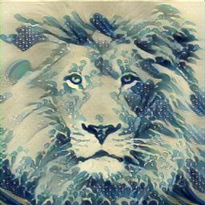

# Neural Style Transfer (Johnson et al.) 

This repository contains a PyTorch implementation of **Fast Neural Style Transfer** based on the paper  
**“Perceptual Losses for Real-Time Style Transfer and Super-Resolution”** by Johnson, Alahi, and Fei-Fei.

The project focuses on understanding and implementing neural style transfer at a **model and optimization level**, rather than treating it as a black-box application. It trains a feed-forward convolutional network that applies artistic style to images in a single forward pass, enabling real-time inference.

---

## Overview

Classic neural style transfer methods perform iterative optimization for every input image, which is computationally expensive and slow. The approach proposed by Johnson et al. replaces this with a **pretrained transformation network** that learns to map content images directly to stylized outputs.

The network is trained using **perceptual loss functions** computed from a fixed, pretrained classification network (VGG). These losses operate in feature space rather than pixel space, allowing the model to preserve semantic content while capturing stylistic patterns.

---

## Key Concepts Implemented

- Feed-forward image transformation network
- Content loss computed from deep feature activations
- Style loss computed using Gram matrices
- Total variation regularization for spatial smoothness
- Offline training with real-time inference capability

---

## Project Structure

```

Neural-Style-Transfer-Johnson/
│
├── src/                  Core modules (models, losses, utilities)
├── train.py              Training script for style transfer network
├── stylize.py            Inference script for applying trained models
├── requirements.txt      Python dependencies
├── LICENSE
└── README.md

````

---

### Example Results
| Content Image | Style Image | Stylized Output |
| ------------- | ----------- | --------------- |
|  |  |  |
|  |  |  |

---

## Installation

Clone the repository:

```bash
git clone https://github.com/Ojas025/Neural-Style-Transfer-Johnson.git
cd Neural-Style-Transfer-Johnson
````

Create and activate a virtual environment:

```bash
python -m venv venv
source venv/bin/activate
```

Install dependencies:

```bash
pip install -r requirements.txt
```

Ensure PyTorch is installed correctly and CUDA is available if using a GPU.

---

## Training

The model is trained on a dataset of content images and a single style image. During training, the transformation network learns to minimize a weighted combination of content loss, style loss, and total variation loss.

Example training command:

```bash
python train.py \
  --content_dir path/to/content_images \
  --style_image path/to/style.jpg \
  --save_model_path models/style_model.pth \
  --epochs 2 \
  --batch_size 4
```

Important parameters:

* `content_dir`: Directory containing training content images
* `style_image`: Image defining the artistic style
* `save_model_path`: Output path for the trained model
* `epochs`: Number of training epochs
* `batch_size`: Training batch size

---

## Inference

Once trained, the model can stylize images in a single forward pass.

Example inference command:

```bash
python stylize.py \
  --model_path models/style_model.pth \
  --input_image path/to/content.jpg \
  --output_image output.png
```

This applies the learned style to the input image without any iterative optimization.

